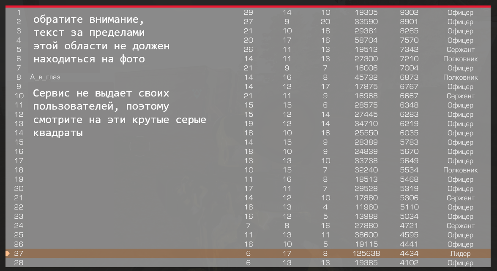
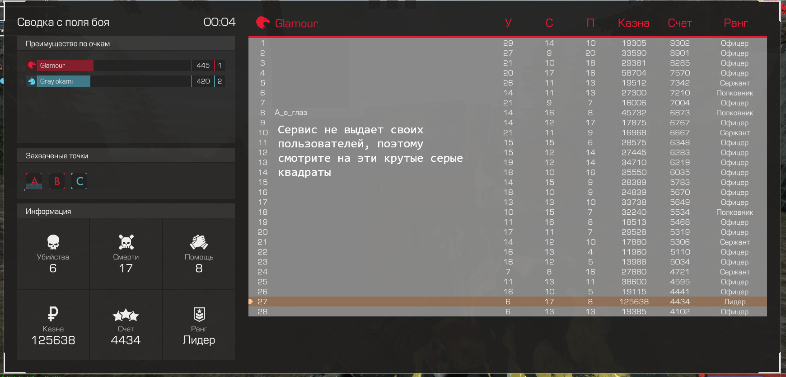
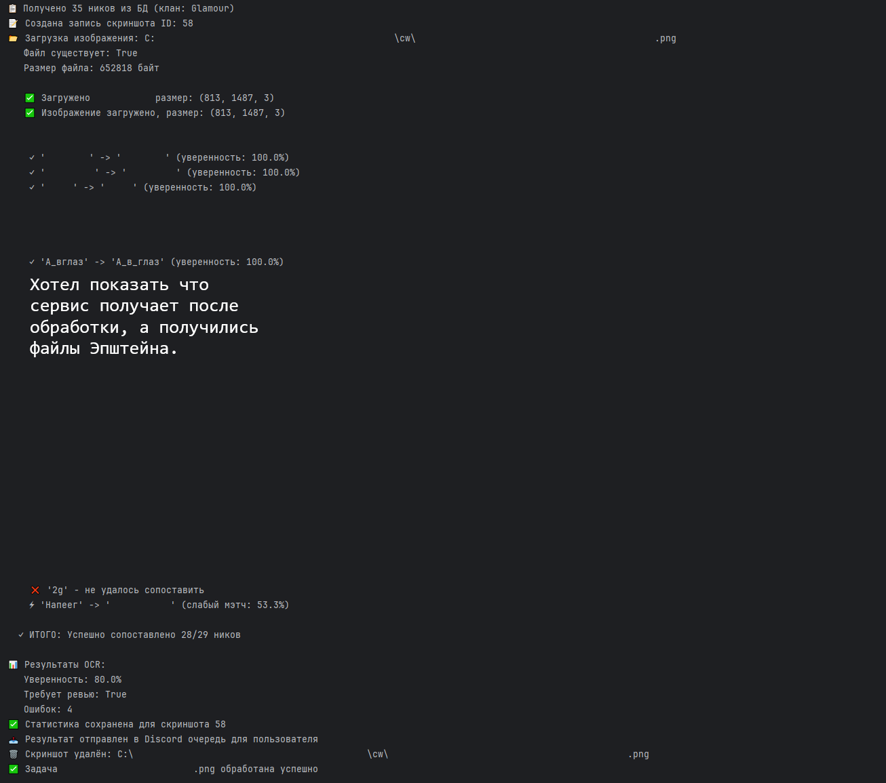
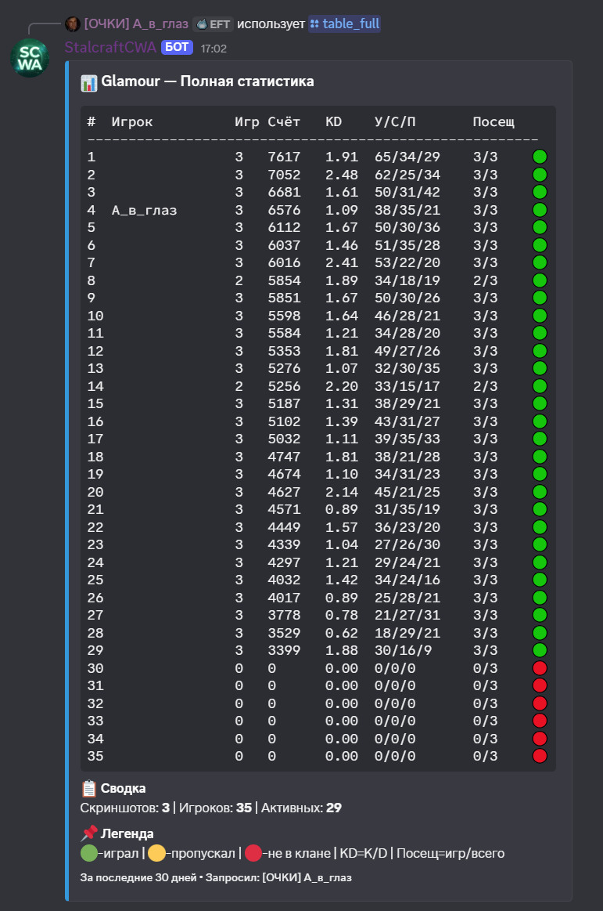
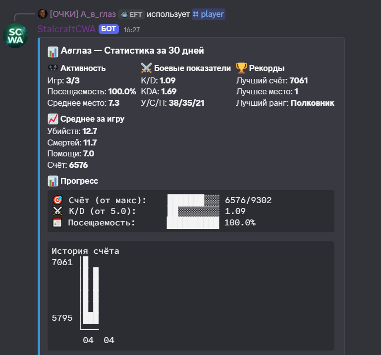

# 📖 Руководство пользователя Stalcraft Clan Analytics

Добро пожаловать в **SCA** — бота для автоматического анализа статистики клановых войн (CW) в игре Stalcraft.

> ⚠️ **Бета-версия сервиса**  
> Stalcraft Clan Analytics находится на стадии активной разработки и тестирования.  
> **Пожалуйста, учитывайте следующее:**
> - Точность распознавания скриншотов может варьироваться в зависимости от качества изображения
> - Некоторые функции могут работать нестабильно или временно отключаться
> - Возможны перерывы в работе бота из-за технических обновлений
> - Лимиты на количество запросов могут изменяться
> 
> Мы прилагаем все усилия, чтобы сделать сервис максимально удобным и точным.  
> **Ваши отзывы и сообщения об ошибках помогают нам становиться лучше!**  
> Конечный вид вывода статистики будет улучшаться, сейчас это, как правило, совсем сырые варианты.
---

## 📑 Содержание

1. [🚀 Первые шаги](#-первые-шаги)
2. [🔐 Авторизация](#-авторизация)
3. [🛡️ Выбор клана](#️-выбор-клана)
4. [📸 Загрузка скриншотов](#-загрузка-скриншотов)
5. [✅ Проверка и подтверждение](#-проверка-и-подтверждение)
6. [📊 Просмотр статистики](#-просмотр-статистики)
7. [👤 Статистика игрока](#-статистика-игрока)
8. [🔧 Управление скриншотами](#-управление-скриншотами-для-лидеров)
9. [📥 Экспорт данных](#-экспорт-данных)
10. [📢 Уведомления и статус бота](#-уведомления-и-статус-бота)
11. [❓ Частые вопросы](#-частые-вопросы)
12. [📞 Поддержка](#-поддержка)

---

## 🚀 Первые шаги

### Приглашение бота на сервер

1. Перейдите по ссылке:  
   **[Пригласить бота](https://discord.com/api/oauth2/authorize?client_id=1487403880991031450&permissions=274878024704&scope=bot%20applications.commands)**
2. Выберите сервер, на который хотите добавить бота.
3. Убедитесь, что у бота есть все запрошенные разрешения (они нужны для чтения сообщений и отправки embed-ответов).
4. Нажмите **«Авторизовать»**.

> 💡 **Важно:** Бот не может читать личные сообщения или историю чата — только команды, которые вы ему отправляете.

### Основные команды (шпаргалка)

| Команда | Что делает |
|---------|------------|
| `/auth` | Авторизация через Discord и EXBO |
| `/clan select` | Выбрать клан для анализа |
| `/add` | Загрузить скриншот (рекомендуемый способ) |
| `/table_full` | Показать полную статистику всех игроков |
| `/player` | Детальная статистика конкретного игрока |
| `/news` | Показать активные уведомления |
| `/help` | Список всех команд |

---

## 🔐 Авторизация

Для работы боту нужен доступ к вашему аккаунту EXBO (Stalcraft). Это нужно, чтобы проверить, в каком вы клане, и получить список его участников.

### Как авторизоваться:

1. Введите команду `/auth` в любом канале, где есть бот.
2. Нажмите на ссылку **«Авторизоваться через Discord»**.
3. Discord спросит разрешение — нажмите **«Подтвердить»**.
4. Вы будете автоматически перенаправлены на сайт EXBO. Нажмите **«Подтвердить»** и там.
5. После успешной авторизации вы увидите страницу с надписью «✅ Авторизация успешна!». Окно можно закрыть.

> 🟢 **Статус авторизации сохраняется надолго.** Повторно входить не нужно, даже после перезапуска бота или компьютера.

---

## 🛡️ Выбор клана

После авторизации нужно указать, статистику какого клана вы хотите отслеживать.

1. Введите `/clan select`
2. Бот попросит: `Введите название клана:`
3. Введите **точное** название вашего клана в Stalcraft (регистр не важен).
4. Бот проверит через API, состоите ли вы в этом клане.
5. Если всё верно, вы увидите сообщение:
✅ Клан Glamour привязан!
Ваш ранг: COLONEL (управление скриншотами)

> 💡 **Примечание:** Бот покажет ваш ранг в клане. **Лидеры (LEADER)** и **полковники (COLONEL)** получают доступ к управлению скриншотами.

---

## 📸 Загрузка скриншотов

### 📏 Как правильно сделать скриншот

**Очень важно:** скриншот должен содержать **ТОЛЬКО таблицу с результатами CW**. Никакого интерфейса игры, чата, кнопок или лишних элементов.

> 💡 **Примечание:** Лучше всего делать полный скриншот (По умолчанию F2) и обрезать его без потери качества, это повысит точность распознавания.

| ✅ Правильно | ❌ Неправильно |
|-------------|---------------|
|  |  |

*Слева — только таблица (так нужно). Справа — весь экран (так НЕ нужно).*

### Загрузка через `/add` (рекомендуется)

1. Введите `/add`
2. Прикрепите скриншот (перетащите файл в окно Discord или выберите через кнопку «Выбрать файл»)
3. Отправьте команду

Бот ответит:
🔄 Обработка скриншота
Пожалуйста, подождите... Идёт распознавание.

Через несколько секунд сообщение обновится и покажет результат.
**Бот, скорее всего, будет ошибаться, поэтому необходима ручная проверка**
---

## ✅ Проверка и подтверждение

После обработки вы увидите таблицу с распознанными данными и **уверенностью** для каждого игрока.

### Что означают метки уверенности:

| Метка | Уверенность | Значение |
|-------|-------------|----------|
| ✅ | > 90% | Всё отлично, данные верны |
| ⚡ | 75% – 90% | Возможны мелкие ошибки, лучше проверить |
| ⚠️ | < 75% | Скорее всего, есть ошибка, требуется проверка |

### Действия с результатом:

| Кнопка | Действие |
|--------|----------|
| **✅ Подтвердить** | Сохранить данные в общую статистику клана |
| **✏️ Редактировать** | Исправить ошибки вручную (выбрать игрока и изменить его показатели) |
| **❌ Отклонить** | Удалить скриншот, не добавляя в статистику |

> 💡 **Совет:** Если вы нажали «Редактировать», выберите игрока из списка, исправьте нужные поля (ник, убийства, смерти, помощь, счёт) и нажмите «Подтвердить». После редактирования не забудьте нажать **✅ Подтвердить** на основном сообщении!

---

### 🤖 Как работает распознавание скриншотов?

Мы используем собственный алгоритм на базе открытой библиотеки **Tesseract OCR**. Это не магия и не искусственный интеллект, который понимает контекст. Алгоритм анализирует изображение и сопоставляет найденные символы с известным списком игроков вашего клана.

**Почему это важно знать:**
*   **Качество скриншота имеет значение.** Размытые, сжатые или слишком тёмные изображения сильно снижают точность. Пожалуйста, загружайте скриншоты в оригинальном качестве.
*   **Обрезайте скриншот.** Алгоритму легче, когда на изображении **только таблица с результатами**, без лишних элементов интерфейса(как показано выше).
*   **Старые скриншоты.** Алгоритм сверяет ники с **актуальным** составом клана. Если вы загружаете скриншот месячной давности, когда состав был другим, точность может упасть.

**Наш подход:**
Мы не пытаемся создать "всевидящее око". Наша цель — **узкоспециализированный и максимально полезный инструмент** для внутренней аналитики клана. Мы постоянно работаем над улучшением алгоритма, в том числе планируем обучать его на данных, полученных во время открытого тестирования. Если вы видите ошибку — вы всегда можете поправить данные вручную, и это поможет нам стать лучше.
---

## 📊 Просмотр статистики

### Полная таблица (`/table_full`)

Показывает статистику **всех игроков клана** за выбранный период.
/table_full days:30

### Что означают столбцы:

| Столбец | Значение |
|---------|----------|
| # | Место по среднему счёту |
| Игрок | Никнейм (обрезается, если длинный) |
| Игр | Количество скриншотов, на которых был игрок |
| Счёт | Средний счёт за игру |
| KD | Соотношение убийств к смертям (Kills / Deaths) |
| У/С/П | Суммарные убийства / смерти / помощь |
| Посещ | Сыграно игр / всего скриншотов (например, `6/8`) |
| 🟢🟡🔴 | Статус: 🟢 играл, 🟡 пропускал (был в клане, но не играл), 🔴 не в клане |

### Таблица по страницам (`/table`)

Если вам удобнее листать по 8 игроков (например, с телефона)

---

## 👤 Статистика игрока

Команда `/player` показывает детальную статистику по конкретному игроку с графиками прогресса.
/player days:30 nickname:MapTuH

### Что показывает команда:

**Основные показатели:**
- 🎮 **Активность:** сколько игр сыграл, посещаемость, среднее место в таблице
- ⚔️ **Боевые показатели:** K/D, KDA, суммарные убийства/смерти/помощь
- 🏆 **Рекорды:** лучший счёт, лучшее место, лучший ранг
- 📈 **Среднее за игру:** средние убийства, смерти, помощь, счёт

**Прогресс-бары:**
- 🎯 **Счёт (от макс):** насколько близко к максимальному счёту в клане
- ⚔️ **K/D (от 5.0):** визуализация K/D (5.0 = 100%)
- 📅 **Посещаемость:** процент посещённых игр

**Графики истории:**
- 📈 **История счёта** — как менялся счёт от игры к игре
- ⚔️ **История K/D** — динамика K/D

**Тренд (последние 3 игры):**
- Показывает, растёт или падает счёт и K/D за последние 3 игры.

---

## 🔧 Управление скриншотами (для лидеров)

Команда `/screenshots` доступна **только лидерам (LEADER)** и **полковникам (COLONEL)** клана.

Введите `/screenshots` и выберите действие:

| Действие | Описание |
|----------|----------|
| 📋 **Список скриншотов** | Показать все загруженные скриншоты с датами и статусами |
| 🗑️ **Удалить скриншот** | Выбрать и удалить конкретный скриншот |
| 🧹 **Удалить дубликаты** | Автоматически найти и удалить повторяющиеся скриншоты |
| 💣 **Очистить все данные** | **Осторожно!** Полностью удалить всю статистику клана |
| 🚫 **Отклонить все неподтверждённые** | Массово отклонить скриншоты, ожидающие проверки |
| 📊 **Экспорт в Excel** | Сохранить данные выбранного скриншота в CSV-файл |

### Статусы скриншотов в списке:

| Статус | Значение |
|--------|----------|
| ✅ | Подтверждён (учтён в статистике) |
| ⏳ | Ожидает подтверждения |
| ❌ | Отклонён (не будет учтён) |

---

## 📥 Экспорт данных

Вы можете сохранить результаты **любого подтверждённого скриншота** в Excel (формат CSV).

1. Введите `/screenshots`
2. Выберите **📊 Экспорт в Excel**
3. Выберите нужный скриншот из списка
4. Бот отправит CSV-файл, который открывается в Excel, Google Sheets или LibreOffice

### Что содержит файл:

| Столбец | Описание |
|---------|----------|
| Место | Позиция игрока в таблице |
| Игрок | Никнейм |
| Убийства | Количество убийств |
| Смерти | Количество смертей |
| Помощь | Количество помощи |
| Казна | Заработанная казна |
| Счёт | Итоговый счёт |
| Ранг | Полученный ранг |
| K/D | Отношение убийств к смертям |
| KDA | Отношение (убийства + помощь) к смертям |
| Уверенность | Уверенность распознавания OCR |

В конце файла — итоговая строка с суммой по всем игрокам.

---

## 📢 Уведомления и статус бота

### Статус бота

Бот автоматически меняет свой статус в Discord в зависимости от ситуации:

| Статус | Активность | Что значит |
|--------|------------|------------|
| 🟢 Онлайн | `Кланчики мои кланчики` | Всё работает штатно |
| 🟡 Не активен | `/news - уведомления` | Есть новые информационные уведомления |
| 🔴 Не беспокоить | `🔧 Тех.работы` | Идут технические работы, команды недоступны |

### Команда `/news`

Показывает все активные информационные уведомления (новости, изменения в правилах, анонсы).
/news

> 💡 **Совет:** Если статус бота 🟡 — введите `/news`, чтобы узнать, что нового.

---

## ❓ Частые вопросы

### ❔ Почему мой ник не распознался?

Бот использует список участников клана из API Stalcraft. Если вы **недавно вступили в клан**, попросите лидера заново выбрать клан через `/clan select` — это обновит список участников.

### ❔ Можно ли загружать скриншоты с телефона?

Да! Используйте `/cw` и `/table` для постраничного просмотра (удобно на маленьких экранах) или `/table_full` и `/add` для просмотра всех игроков сразу.

### ❔ Что делать, если бот долго обрабатывает скриншот?

Обычно обработка занимает 3-10 секунд. Если прошло больше минуты — возможно, бот перегружен. Попробуйте позже или обратитесь в поддержку.

### ❔ Как часто обновляется список кланов?

- Список **всех кланов** Stalcraft обновляется раз в 24 часа.
- Список **участников вашего клана** обновляется при каждом выборе клана через `/clan select`.

### ❔ Что делать, если бот не отвечает на команды?

1. Проверьте статус бота (должен быть 🟢 или 🟡)
2. Если статус 🔴 — идут технические работы, подождите
3. Попробуйте переавторизоваться через `/auth`
4. Если ничего не помогает — обратитесь в поддержку

### ❔ Мои данные в безопасности?

Да. Мы **не храним**:
- Пароли от Discord и EXBO (Эти данные мы и не получаем)
- Загруженные скриншоты (удаляются сразу после обработки)
- Платёжные данные

Мы **храним только**:
- Статистику CW (30 дней)
- Список участников клана

Подробнее в [Политике конфиденциальности](https://sahabush.github.io/Stalcraft-Clan-Analytics/privacy).
---
### 💎 Наша философия

**Stalcraft Clan Analytics — это инструмент для созидания, а не для разрушения.**

*   Мы созданы, чтобы помогать лидерам и офицерам **развивать свой клан**: видеть прогресс бойцов, отмечать самых активных и полезных, принимать взвешенные решения.
*   Мы **не поддерживаем** использование сервиса для травли, публичного порицания игроков или создания токсичной атмосферы.
*   Вся собираемая статистика — это лишь **цифры**. За ними стоят реальные люди. Используйте эти данные мудро и во благо вашего сообщества.
---
### 🛡️ Почему с нами безопасно?

 Stalcraft Clan Analytics работает только с **легальными и открытыми источниками**:
*   **EXBO API** для получения публичной информации о клане и его составе.
*   **Скриншоты**, которые вы загружаете добровольно.

Мы не нарушаем пользовательское соглашение Stalcraft, не используем запрещённое ПО и не создаём рисков для ваших аккаунтов. Ваша безопасность — наш приоритет.

---

## 📞 Поддержка

Если у вас остались вопросы, обнаружили ошибку или нарушение правил, соглашений, хотите предложить улучшение:

- **Discord сервер:** [https://discord.gg/uS4sbeYdyp](https://discord.gg/uS4sbeYdyp)  
  (создайте тикет в канале `#поддержка`)
- **Электронная почта:** [StalcraftCWASupport@protonmail.com](mailto:StalcraftCWASupport@protonmail.com)
- **Команда в боте:** `/news` — просмотр системных уведомлений

Мы отвечаем в течение 24 часов (обычно быстрее).

---

**Удачных боёв и точной статистики! 🎮**

© Stalcraft Clan Analytics, 2026